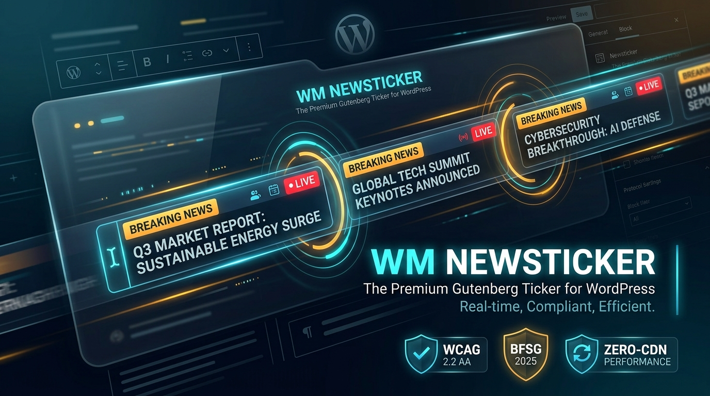

# WM Newsticker

> **Gutenberg block for animated news tickers: scroll, fade, slide and typing, with manual headlines or the latest posts**  
> **Author:** Arnold Wender · Wender Media · Halle (Saale), Germany  
> **Website:** [https://www.wendermedia.com](https://www.wendermedia.com) · **Repository:** [github.com/arnoldwender/wm-newsticker](https://github.com/arnoldwender/wm-newsticker)

> This README describes what the plugin ships, measured against the code on 2026-09-15. Until then it also promised conformity with BFSG 2025 and WCAG 2.2 AA, a pause on keyboard focus, 44 × 44 px controls, "60 FPS", "~3KB CSS, ~2KB JS", DSGVO Art. 17 erasure tools and pre-compiled translations for 24 EU languages. None of that holds; the Known issues below say what does.



Screens of the handbook and the dashboard widget: `docs/screenshots/`.

---

## What the plugin does

1. **One dynamic block, `wm/newsticker`.** `block.json` (API version 3) with an editor script (`build/index.js`), editor and frontend styles and a view script (`build/frontend.js`) that WordPress loads only on pages carrying the block. The markup comes from `WM_Newsticker::render_block()` on every page view.
2. **Four animations.** Scroll (a CSS `translateX` keyframe loop; with more than two items the server renders the list twice so the loop is seamless), fade, slide and typing. Direction left, right, up or down, a right-to-left toggle, a speed slider from 10 to 100 that sets the animation duration.
3. **Two content sources.** Manual headlines (text, link, open in new tab) or the latest published posts of a public post type that is available in the REST API: 1 to 20 posts, optional category and tag filters, ordered by date, title, modified date, random or comment count, optionally prefixed with a relative or absolute date. Post queries are cached for 5 minutes in a transient; `save_post` and `deleted_post` clear the cache.
4. **Design attributes.** Background, text, label background, label text and border colours (hex with 3, 4, 6 or 8 digits, `rgb()` / `rgba()`, `var(--…)`, `transparent`, `inherit`, `currentcolor`; anything else becomes `#000000`), padding, margin, border radius, border width and style, four shadow presets, font size 10 to 72 px, height 20 to 200 px, an optional label and a separator of up to five characters.
5. **Optional controls** (off by default): previous / next, play / pause, a progress bar, placed left or right. The ticker pauses while the mouse is over it (on by default).
6. **Accessibility in the markup.** The wrapper carries `role="region"`, `aria-roledescription="marquee"`, a translated `aria-label` and `aria-live="off"`; the controls are `<button>` elements with labels and a 2 px focus outline; with `prefers-reduced-motion: reduce` the scroll animation and the slide rotation do not run.
7. **Admin.** A handbook screen (top-level menu *WM Newsticker*, its submenus and an entry under *Settings*) with a live preview that is the block's real `render_block()` output, contextual help tabs, buttons that create or delete demo content (four example posts and an example page, marked with `_is_wm_newsticker_demo`), and a dashboard widget with counted figures (pages carrying the block, demo posts, cached queries). All of it on the Wender Media admin family sheets.
8. **WP-CLI:** `wp newsticker post-types`, `wp newsticker flush-cache`, `wp newsticker demodaten --import | --delete | --reset [--yes]` (`--reset` deletes the demo content and clears the cache).
9. **REST route** `GET /wp-json/wm-newsticker/v1/post-types` for the editor, `permission_callback` `current_user_can( 'edit_posts' )`; it lists public post types with REST support, without attachments.
10. **Filter** `wm_newsticker_rendered_items( $items, $attributes )`, applied before escaping.
11. **WM Suite Hub spoke** (`includes/class-newsticker-spoke-adapter.php`): SBOM entry with the SHA-256 of the main file, telemetry and actions, registered through `wm_register_suite_module`.
12. **WPML:** `wpml-config.xml` marks the label, the separator and the headline texts as translatable.

### Not shipped

No settings of its own (the handbook screen has no options), no shortcode, no classic widget, no pause on keyboard focus, no processing of visitors' personal data, no cookies or browser storage, no external requests.

---

## Quick start

1. Install and activate the plugin (WordPress 5.9+, PHP 7.4+ per the header; CI tests PHP 8.1 to 8.3).
2. In the block editor insert **Newsticker** (`/newsticker`).
3. Choose the content source, the animation and the colours in the block sidebar; switch on the controls if visitors should be able to stop the ticker.
4. The handbook under **WM Newsticker** shows a live preview and can create example content.

---

## Developers

Architecture: [docs/ARCHITECTURE.md](docs/ARCHITECTURE.md) · Classes, attributes and hooks: [docs/DEVELOPER-GUIDE.md](docs/DEVELOPER-GUIDE.md) · Accessibility: [docs/ACCESSIBILITY.md](docs/ACCESSIBILITY.md) · Privacy: [docs/DSGVO-COMPLIANCE.md](docs/DSGVO-COMPLIANCE.md) · Security notes: [docs/SECURITY-AUDIT.md](docs/SECURITY-AUDIT.md)

```bash
npm install
npm run build        # wp-scripts build; postbuild bin/harden-build-assets.mjs re-adds the ABSPATH guard to build/*.asset.php
npm run start        # watch mode

php tests/test-suite.php          # standalone suite, no WordPress needed
bash tests/run-mutations.sh       # each correction in tests/mutations.php undone must turn the suite red
php tests/test-ui-family.php      # admin family sheets byte-identical to the hub

# inside WordPress
wp eval-file wp-content/plugins/wm-newsticker/tests/test-newsticker-core.php
wp eval-file wp-content/plugins/wm-newsticker/tests/test-i18n.php
```

`build/` is versioned so the plugin installs without a build step.

### Known issues

- **Keyboard users cannot stop the motion without the controls.** The ticker pauses on hover only; focusing a link inside it does not pause it, and the controls are off by default.
- **Control buttons are 28 × 28 px** (16 px icon plus 6 px padding; 24 × 24 px up to 782 px viewport width), below the 44 × 44 px often asked for touch targets.
- **Default label colours:** white on `#e94560` is 3.83:1, below 4.5:1 for 14 px text (WCAG 1.4.3 AA). The label is empty by default; it matters once a label text is set without changing the colours. White on the default background `#1a1a2e` is 17.06:1.
- The play / pause button's label switches to the untranslated English "Play" / "Pause" after the first click (set in `src/frontend.js`).
- **Translations:** the editor has German and Spanish JSON translations (101 and 103 of 105 strings). The 28 PHP catalogs in `languages/` mostly repeat the source string (measured 2026-09-15: de_DE 2 of 171 entries translated, es_ES 3, 15 catalogs 0); the admin screens are German.
- `uninstall.php` deletes the ticker's transients only; demo posts created with the handbook stay until "Demodaten bereinigen" removes them.
- Demo posts seeded before 2026-09-15 carry invented news headlines (see CHANGELOG); remove them with "Demodaten bereinigen" and seed again if needed.

---

## Privacy and accessibility

- **No external requests:** scripts, styles and icons are served from the plugin; no fonts, CDNs or tracking.
- **No personal data:** the block renders post titles and headlines; it sets no cookies and writes no browser storage.
- **Accessibility:** the measures in the markup are listed above, the gaps under Known issues. No audit against WCAG or the BFSG was made, and no conformity is claimed.

---

## License

GPL v2 or later — see [LICENSE](LICENSE) or the [GNU General Public License v2.0](https://www.gnu.org/licenses/gpl-2.0.html).
