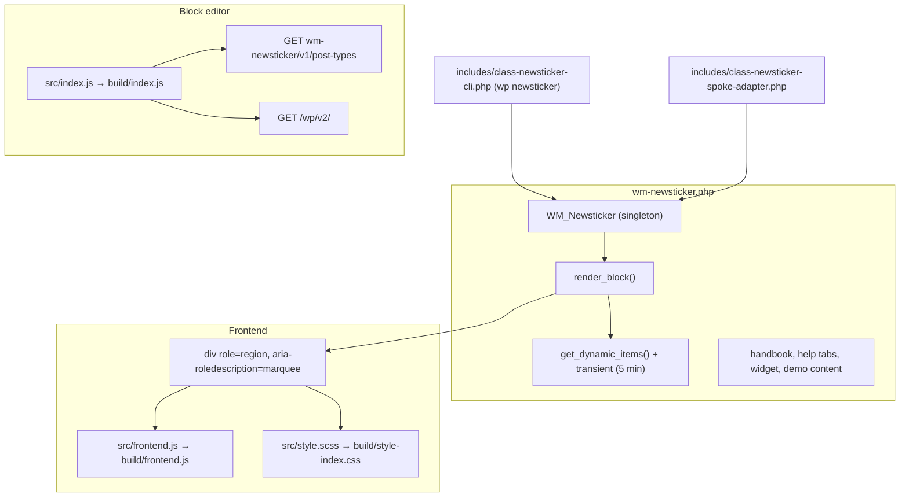

# Architecture — WM Newsticker

> Measured against the code on 2026-09-15. The previous edition described an `<aside>` wrapper, live-region announcements, a pause on keyboard focus, "60 FPS" `translate3d` animations, "~3KB CSS", HTTP 401/403 for unauthenticated REST calls "immediately", 24 compiled EU translations and compliance with BFSG 2025 and WCAG 2.2 AA.

## Components



## Block

- `block.json`: API version 3, 36 attributes with defaults, `editorScript`, `editorStyle`, `style`, `viewScript`. `register_block_type( WM_NEWSTICKER_PLUGIN_DIR, [ 'render_callback' => … ] )` on `init`.
- `render_block( $attributes )`: resolves the items (manual, sanitised per item, or `get_dynamic_items()`), applies `wm_newsticker_rendered_items`, returns `''` when there is nothing to show, checks every attribute (see [SECURITY-AUDIT.md](SECURITY-AUDIT.md)), computes the animation duration (scroll: `max( 10, items × ( 100 − speed ) / 5 )` seconds; the others: `max( 2, ( 100 − speed ) / 10 )` seconds per item) and prints the markup.
- Scroll: one track with CSS keyframes on `translateX` (−50 % / 50 % when the items are rendered twice, −100 % / 100 % otherwise); the server renders the list twice when there are more than two items.
- Fade, slide, typing: one element per item; `src/frontend.js` switches the `active` class on an interval.

## Dynamic items

`get_dynamic_items()` builds a `WP_Query` (`post_status` publish, 1–20 posts, allowlisted order, optional `category__in` / `tag__in`), keys a transient on the MD5 of the query arguments plus the date settings, caches the resulting items 5 minutes and returns them. `flush_transient_cache()` deletes every `_transient_wm_newsticker_*` and `_transient_timeout_wm_newsticker_*` row on `save_post` and `deleted_post`. There is no lock: concurrent requests that miss the cache run the query each.

## Frontend script

`src/frontend.js` initialises every `.wm-newsticker-wrapper` once: scroll tickers pause and resume through `animation-play-state`; slide tickers rotate with `setInterval` and support previous / next / play-pause; `mouseenter` / `mouseleave` pause when `data-pause-on-hover` is true; `prefers-reduced-motion` pauses the track and starts rotations paused.

## Admin

- Menus: top-level `wm-newsticker` (position 29), submenus `wm-newsticker` and `wm-newsticker-docs`, options page `wm-newsticker-settings`; all render `render_admin_docs_page()`.
- `enqueue_admin_assets()`: family sheets (`assets/css/wm-admin-tokens.css`, `assets/css/wm-admin-ui.css`, pinned by `tests/test-ui-family.php`), `assets/css/newsticker-admin.css`, on the plugin screens also the block's frontend style and view script for the live preview and `assets/js/newsticker-admin.js` (confirmation dialogs).
- `handle_admin_actions()` on `admin_init`: seed, delete demo content, reset (`manage_options`, nonces).
- Dashboard widget `wm_newsticker_widget` with counts cached 5 minutes.

## WP-CLI

`WM_Newsticker_CLI_Command`: `post-types` (all public post types), `flush-cache`, `demodaten --import | --delete | --reset [--yes]`.

## Persistence

No options of its own (the reset still deletes `wm_newsticker_settings`, which nothing writes), transients `wm_newsticker_*`, demo posts with the meta `_is_wm_newsticker_demo`. No tables.

## Translations

Text domain `wm-newsticker`. `languages/` has a `.pot`, 28 `.po` / `.mo` pairs (mostly untranslated, see README) and editor JSON translations for de_DE and es_ES loaded with `wp_set_script_translations()`.

---

<!-- wm-measured-inventory -->

## Measured inventory

Regenerated from the code, never hand-edited. Everything above this line is written by hand and stays.

```bash
python3 the fleet's architecture inventory tool wm-newsticker --append-to docs/ARCHITECTURE.md
```

## Inventory by layer

**6 PHP files, 1655 lines** (excluding `tests/`, `vendor/`, `node_modules/`, `languages/`).

| Layer | Files | Lines |
|---|---:|---:|
| `(raíz)` | 2 | 1414 |
| `build` | 2 | 6 |
| `includes` | 2 | 235 |

---

## Classes

| Class | File |
|---|---|
| `Newsticker_Spoke_Adapter` | [`includes/class-newsticker-spoke-adapter.php`](../includes/class-newsticker-spoke-adapter.php) |
| `WM_Newsticker` | [`wm-newsticker.php`](../wm-newsticker.php) |
| `WM_Newsticker_CLI_Command` | [`includes/class-newsticker-cli.php`](../includes/class-newsticker-cli.php) |

---

## Entry points

**REST routes:** `/post-types`

**WP-CLI:** `newsticker`

**Gutenberg blocks:** `wm/newsticker`

---

## Persistence — who writes each key and who reads it

| Key | Written by | Read by |
|---|---|---|
| `wm_newsticker_widget_stats` (transient) | — | — |

Every key has exactly one writing layer and at least one reader.


---

## Gates

- `tests/mutations.php`
- `tests/run-mutations.sh`
- `tests/test-i18n.php`
- `tests/test-newsticker-core.php`
- `tests/test-suite.php`
- `tests/test-ui-family.php`
- `.github/workflows/ci.yml`

What CI actually runs is in the workflow files above — a test file that no workflow invokes is not a gate.

---

## Drift detected against the documentation

Nothing measurable: versions agree and every class named in the documents exists.

